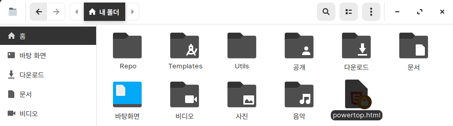
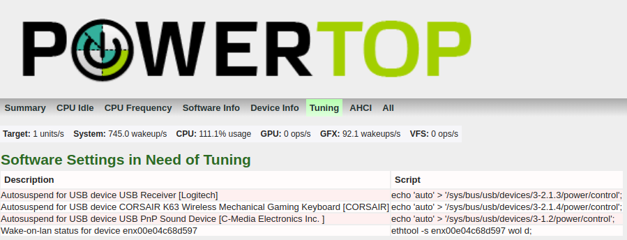
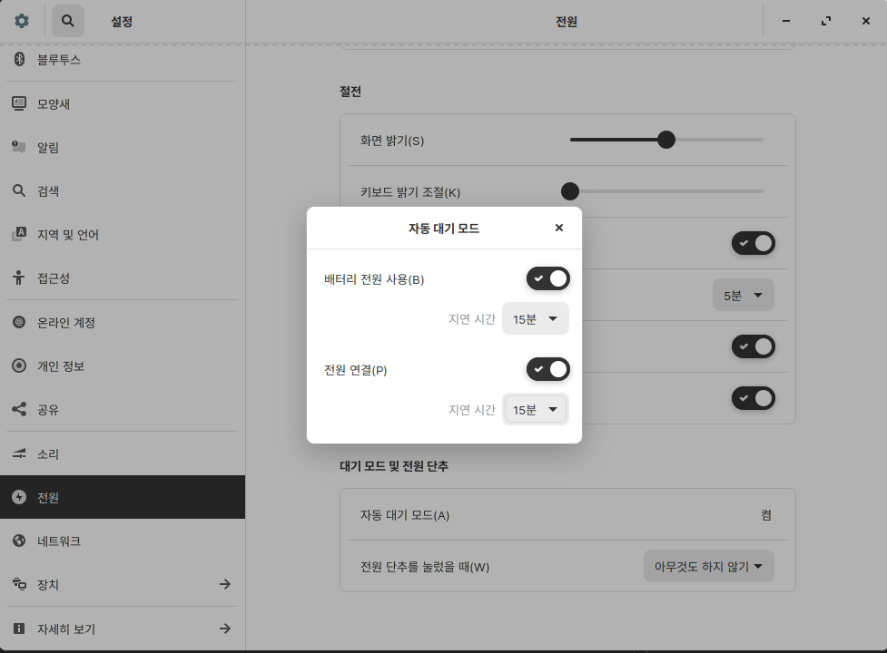

# 참고 자료
* https://wiki.archlinux.org/
* https://wiki.manjaro.org/

# 전력 관리 설정
대부분의 리눅스 배포판은 세부적인 절전 설정을 사용자가 따로 해주어야 한다.  DELL 7275 태블릿에 다양한 리눅스 배포판을 설치해보고 절전 설정과 씨름하면서 알게된 그나마 괜찮은 것 같은 절전 설정 방법을 기록한다.
> 절전 설정으로 얻을 수 있는 효과:
>   DELL 7275의 슬립모드 기준으로 `설정 전 2.4W` -> `설정 후 0.9W`으로 절감된다.
## 1. `powertop`과 `tlp`를 이용한 방법
조금은 귀찮은 방법이지만 세밀하게 자신에게 맞는 설정을 찾아갈 수 있고, 문제가 발생해도 수정할 수 있다.
### 설정 절차
* `powertop`과 `tlp`, `tlpui`를 설치한다.

  `debian 계열 (ubuntu, zorin, Mint, MX, Deepin 등)`
  ```bash
  $ sudo add-apt-repository ppa:linuxuprising/apps # tlpui를 설치하기 위한 저장소 추가
  $ sudo apt-get update
  $ sudo apt-get install powertop tlp tlpui
  ```
  `arch 계열 (manjaro 등)`
  ```bash
  $ sudo pacman -Sy
  $ sudo pacman -S powertop tlp
  $ git clone "https://aur.archlinux.org/tlpui-git.git"
  $ cd tlpui-git
  $ makepkg -si
  ```
  `manjaro`
  ```bash
  $ pamac install powertop tlp tlpui
  ```
  OR

  그냥 GUI에서 `소프트웨어 추가/제거`로 powertop, tlp, tlpui 설치
* `tlp` 시작

  `debian 계열 (ubuntu, zorin, Mint, MX, Deepin 등)`
  ```bash
  $ sudo tlp start
  ```
  `arch 계열 (manjaro 등)`
  ```bash
  $ systemctl enable --now tlp
  $ systemctl enable --now tlp-sleep.service
  $ sudo tlp start
  ```
* powertop으로 `Tunables` 목록 확인
  #### 터미널로 확인하는 방법
  * powertop 실행
    ```bash
    $ sudo powertop
    PowerTOP v2.9     Overview   Idle stats   Frequency stats   Device stats   Tunables
    The battery reports a discharge rate of 8.30 mW
    The power consumed was 164 mJ
    The estimated remaining time is 3008 hours, 59 minutes
    ...
    <ESC> Exit | <TAB> / <Shift + TAB> Navigate |
    ```
  * `Shift + TAB`을 눌러 Tunables 탭으로 이동하여 `Bad` 항목 확인
    ```bash
    PowerTOP v2.9     Overview   Idle stats   Frequency stats   Device stats   Tunables

    >> Bad           Autosuspend for USB device CORSAIR K63 Wireless Mechanical Gaming Keyboard [CORSAIR]
      Bad           Autosuspend for USB device USB PnP Sound Device [C-Media Electronics Inc.      ]
      Bad           Autosuspend for USB device USB Receiver [Logitech]
      Bad           Wake-on-lan status for device enx00e04c68d597
      Good          NMI watchdog should be turned off
    ...
    ```
  #### 웹으로 확인하는 방법
  * powertop 결과를 html 파일로 내보내기
    ```bash
    $ cd
    $ sudo powertop --html
    ```
  * 파일 관리자를 열어 홈으로 이동해서 powertop.html 파일 실행
    
  * `Tuning` 탭으로 이동하여 `Software Settings in Need of Tuning`의 항목 확인
    
* `tlpui`로 절전 설정 변경
  * `tlpui` 실행
    ```
    $ sudo tlpui
    ```
  * 시험 삼아 `PCIe` > `RUNTIME_PM` > `RUNTIME_PM_ON_AC` 활성화 상태로 변경
    
  * 상단 메뉴에서 File > Save 버튼을 눌러 변경 사항 저장
  * 변경된 사항을 적용하기 위해 tlp 재시작
    ```
    $ sudo tlp start
    ```
* `powertop`의 `Tuntables` 목록이 어떻게 바뀌었는지 확인해보자
* 이렇게 tlp로 하나 바꾸고 powertop으로 확인해보면서 맞는 설정을 찾아가보자.
  > 참고: `Tuntables`의 모든 항목을 `Good`으로 변경하는 것이 좋은 것은 아니다. 전력 소모에 `Good`이라는 것이지, 기능과 성능으로는 `Bad`일 수 있다.
### **추천하는 옵션값(특히 DELL 7275 / 9250 사용자일 경우)**
* `Audio` > `SOUND_POWER_SAVE_ON_AC` 활성화

  시스템에서 아무 소리도 재생되지 않을 때에도 스피커가 활성화되어 있어서 전력(7275 기준 500mW)을 계속 잡아먹고 있는다. 이 옵션을 활성화하면 소리가 재생되지 않을 때에는 스피커를 꺼서 전기를 절약할 수 있다.
* `Disks` > `SATA_LINKPWR_ON_AC`에서 `min_power`와 `max_performance`를 활성화한다.

  Disk를 사용중일 때에는 `max_performance`로 동작하고 슬립모드에서는 `min_power`로 동작한다. 이 옵션을 활성화하면 슬립모드의 전기 소모량이 줄어든다. `DELL 7275는 사실상 이 옵션만 설정해도 슬립모드 시 전력 소모량이 0.9W로 줄어든다.`
* `PCIe` > `PCIE_ASPM_ON_AC`를 default로 설정
* `PCIe` > `RUNTIME_PM_ON_AC` 활성화
* `Processor` > `SCHED_POWERSAVE_ON_AC` 활성화

  CPU 부하량을 감당할 수 있는 최소의 쓰레드만 사용하여 전력소모를 줄이는 옵션이다. 경우의 따라 지연이 발생하는 등의 성능 하강을 체감할 수 있으니 기호에 맞게 설정하자.
* `Processor` > `ENERGY_PERF_POLICY_ON_AC`를 `balance-performance`로 설정

  OS 레벨의 CPU 제어 규칙을 설정하는 옵션
* `USB` > `USB_BLACKLIST_BTUSB` 활성화 혹은 `USB_BLACKLIST`에서 `(btusb)`로 끝나는 항목 활성화

  DELL 7275에서 블루투스를 블랙리스트에 등록하지 않으면 슬립모드에서 깨어났을 때 블루투스가 먹통이 되는 문제가 있다. 만약 7275에서 블루투스가 먹통이 되었는데 시스템을 재시작해도 블루투스가 살아나지 않는 경우, 윈도우로 부팅해보거나 바이오스에서 블루투스를 비활성화 한뒤 뒤 부팅하고, 다시 활성화하고 부팅해보면 살아난다.
* (참고) `Processor`의 `CPU_SCALING_GOVERNOR`와 `CPU_HWP`의 차이점

  두 옵션은 CPU의 연산량에 따라 CPU의 전력을 조절하는 옵션이다. `CPU_HWP`는 인텔 2세대 CPU(샌디브릿지) 이상에서 사용하는 p-state 드라이버를 통해 동작 상태를 제어한다. 따라서 2세대 전의 CPU를 사용중이라면 `CPU_SCALING_GOVERNOR`를 설정해야한다. `sudo tlp stat -p` 명령어를 통해 CPU의 `scaling_driver`를 확인해보면 어떤 드라이버를 사용하고 있는지 확인할 수 있다.
## 2. `powertop --auto-tune`을 이용한 방법
간단한 방법이지만 세밀한 조정이 어려워서 부작용이 많다. 예를 들어 마우스가 버벅인다던가.. 블루투스가 먹통이 된다던가.. 간혹가다 프리징이 걸려서 강종해야 한다던가..
### 설정 절차
* `powertop`을 설치한다.

  `debian 계열 (ubuntu, zorin, Mint, MX, Deepin 등)`
  ```bash
  $ sudo apt-get update
  $ sudo apt-get install powertop
  ```
  `arch 계열 (manjaro 등)`
  ```bash
  $ sudo pacman -Sy
  $ sudo pacman -S powertop
  ```
  `manjaro`
  ```bash
  $ pamac install powertop
  ```
  OR

  그냥 GUI에서 `소프트웨어 추가/제거`로 powertop 설치
* (선택) powertop의 절전 제어 오차를 줄이기 위해 캘리브레이션을 수행한다.
  ```bash
  $ sudo powertop --calibrate
  ```
* powertop이 자동으로 절전 문제를 해결하도록 한다.
  ```bash
  $ powertop --auto-tune
  ```
* (선택) powertop을 서비스로 등록

  `powertop --auto-tune` 명령어는 시스템을 재시작하면 효력이 사라진다. 원한다면 서비스를 등록하여 시스템이 시작될 때 `powertop --auto-tune` 명령을 수행하도록 설정할 수 있다.

  `debian 계열 (ubuntu zorin, Mint, MX, Deepin 등)`
  ```bash
  # 서비스 파일 생성
  $ cat << EOF | sudo tee /etc/systemd/system/powertop.service
  [Unit]
  Description=PowerTOP auto tune

  [Service]
  Type=idle # 서비스 관리자에서 모든 서비스가 완료되면 실행
  Environment="TERM=dumb"
  ExecStart=/usr/sbin/powertop --auto-tune

  [Install]
  WantedBy=multi-user.target
  EOF

  # 생성한 서비스 사용 등록
  $ systemctl enable powertop.service

  # 서비스 시작
  $ systemctl start powertop.service
  ```
  `Arch 위키에서 추천하는 설정`

  (위에거랑 별 차이 없는거 같은데.. -> https://www.freedesktop.org/software/systemd/man/systemd.service.html)
  ```bash
  # 서비스 파일 생성
  $ cat << EOF | sudo tee /etc/systemd/system/powertop.service
  [Unit]
  Description=Powertop tunings

  [Service]
  Type=exec # 서비스 관리자에서 모든 메인 서비스 작업이 완료되면 실행
  ExecStart=/usr/bin/powertop --auto-tune
  RemainAfterExit=true

  [Install]
  WantedBy=multi-user.target
  EOF

  # 생성한 서비스 사용 등록
  $ systemctl enable powertop.service

  # 서비스 시작
  $ systemctl start powertop.service
  ```
# gnome Suspend Timeout 15분 미만으로 설정
그놈 데스크탑 환경에서 `자동 대기 모드 지연 시간`을 설정하기 위해서 설정화면으로 들어가면 아래처럼 최소 15분으로 밖에 설정을 못한다. 요걸 Command Line을 통해 15분 미만으로 설정하는 방법을 기록한다.

## 설정 방법
* `gsettings`를 사용해서 설정 절전 시간 설정 값의 Key 찾기
  ```bash
  # 15분으로 설정해놓았다면 900으로 설정되어 있는 Key가 2개 보일 것이다.
  $ gsettings list-recursively | grep -i "sleep\|suspend"
  org.gnome.desktop.screensaver ubuntu-lock-on-suspend true
  org.gnome.settings-daemon.plugins.power sleep-inactive-ac-timeout 900 # 전원 사용시
  org.gnome.settings-daemon.plugins.power critical-battery-action 'suspend'
  org.gnome.settings-daemon.plugins.power lid-close-suspend-with-external-monitor false
  org.gnome.settings-daemon.plugins.power sleep-inactive-ac-type 'suspend'
  org.gnome.settings-daemon.plugins.power button-suspend 'suspend'
  org.gnome.settings-daemon.plugins.power button-sleep 'suspend'
  org.gnome.settings-daemon.plugins.power sleep-inactive-battery-timeout 900 # 배터리 사용시
  org.gnome.settings-daemon.plugins.power lid-close-ac-action 'suspend'
  org.gnome.settings-daemon.plugins.power sleep-inactive-battery-type 'suspend'
  org.gnome.settings-daemon.plugins.power lid-close-battery-action 'suspend'
  ```
* 조회된 절전 시간 Key에 원하는 시간(초)를 설정
  ```bash
  # AC와 배터리 모두 5분(300)으로 설정하였다.
  $ gsettings set org.gnome.settings-daemon.plugins.power sleep-inactive-ac-timeout 300
  $ gsettings set org.gnome.settings-daemon.plugins.power sleep-inactive-battery-timeout 300

  # 잘 변경되었는지 확인
  $ gsettings list-recursively | grep -i "sleep-inactive"
  org.gnome.settings-daemon.plugins.power sleep-inactive-ac-timeout 300
  org.gnome.settings-daemon.plugins.power sleep-inactive-ac-type 'suspend'
  org.gnome.settings-daemon.plugins.power sleep-inactive-battery-timeout 300
  org.gnome.settings-daemon.plugins.power sleep-inactive-battery-type 'suspend'
  ```